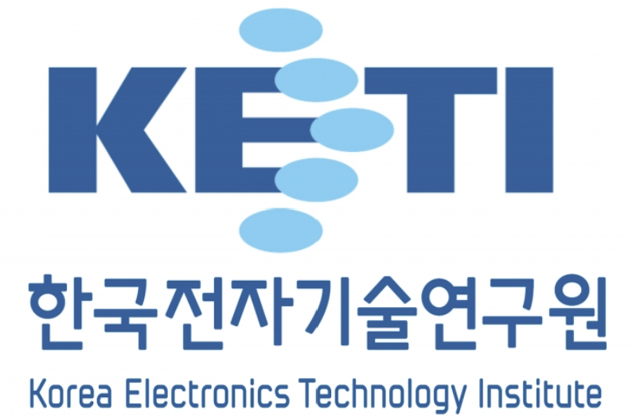
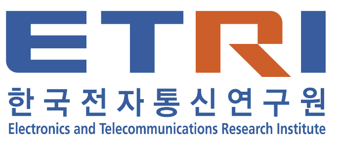
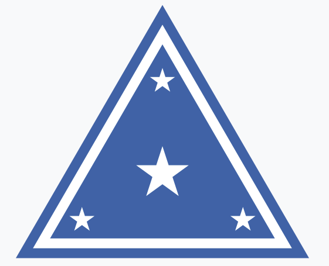

<h1 align="center">Hi 👋, I'm SungHo Moon</h1>
<h3 align="left">A passionate Computer Vision(2D/3D) Engineer in Korea.</h3>

- I plan to continue uploading the projects I have done in the future.

- 🌱 I’m currently learning **multi-modal, multi-camera, lidar.**

- 👯 I’m looking to collaborate on **everything about computer vision.**

- 💬 Ask me about **everything about me.**

- 📫 How to reach me **byul3325@naver.com or byul3325@gmail.com.**

- 🙊	my github blog [git blog](https://byeol3325.github.io/).

- 👇 I have experience collaborating with companies here !!! **About 2D/3D Object Detection, 3D Reconstruction(Bundle Adjustment, Pose Graph Optimization), On-board(memory & time optimization), Camera Calibration(using 1D/2D chessboard), AI ethics, AI module performance improvement in specific environment ...**
          

  
Brief description of the projects involved 📚 

1. 3D Building Exterior Reconstruction(KETI ) - 20.08 ~ 20.12 
- Goal : Build a 3D reconstruction module using monocular images.
- Role : Lead Researcher (80% contribution) – Developed keypoint matching (SIFT/SURF), computed epipolar lines, estimated camera relationships, and implemented PnP & BA... etc. Worked on all major steps of the 3D reconstruction process.
- Acheivement : Successfully developed a 3D reconstruction module using monocular images.

2. Robust monocular camera 3D object detection in various camera environments(Hyundai) - 21.03 ~ 22.06
- Goal : Solve the problem that monocular camera 3D object detection has significantly reduced performance depending on the camera environment.
- Role : Lead Researcher (70% contribution) – Developed data augmentation for images with different camera angles, analyzed the causes of performance drops, and developed correction algorithms to prevent degradation.
- Acheivement : Identified key reasons for performance degradation. Improved accuracy from 20% to 80% for a 3-degree angle difference and from 1% to 50% for a 5-degree angle difference. Results led to international patents and publications.

3. Development of car location and speed estimation module from CCTV - 22.08 ~ 22.12
- Goal : Develop a module to estimate car position and speed using only CCTV video.
- Role : Lead Researcher (80% contribution) - Developed on road detection and image warping, vehicle speed estimation, and optimized performance.
- Acheivement : Achieved over 90% accuracy in vehicle speed estimation on the given dataset.

4. Miltitary Scientific Surveillance System(육군본부) - 23.03 ~ 23.09
- Performance Enhancement Officer (30% contribution)
- 목표 : AI 경계감시시스템 구축을 통해 오탐지/미탐지 감소 및 정탐지 향상
- 역할 : TOD 카메라 정보(카메라로부터 절대 거리 가능)를 활용하여 오탐지를 획기적으로 줄였음
- 성과 : 기존 대비 오탐지를 10% 줄였음

5. AI 무기체계 시험평가 기준 설립(육군본부, 미국방부) - 23.03 ~ 24.06
- AI 시험평가 연구원 (30% contribution)
- Goal : Develop new testing and evaluation standards for AI weapon systems, which differ significantly from traditional weapon systems.
- Role : As an AI Test and Evaluation Researcher, collaborated with the U.S. Department of Defense, coordinated with the Ministry of National Defense, and conducted extensive research on AI weapon systems, including identifying requirements (Contribution 30%).
- Achievements : Established initial standards for the Military Performance Certification Center (including dataset construction, baseline model development, and formulation of various strategies).

6. AI 시험평가 기준 모델 연구개발(육군본부) - 23.10 ~ 24.06
- Lead Researcher (60% contribution)
- Goal : When introducing various AI weapon systems in the Army, create a military learning/test data set and build an AI model that serves as a standard.
- Role : Developed an Auto-Labeler for military datasets, performed data cleansing and construction, and developed a baseline model for performance verification (Contribution 60%).
- Achievements : Established initial standards for the Military Performance Certification Center(including dataset construction, baseline model development, and formulation of various strategies).

7. 프로젝트 이름 찾기(휴비츠) - 24.06 ~ 24.12
- 핵심 개발자 (40% contribution)
- 목표 : 
- 역할 : Multi-Thread와 자료구조 개선을 통한 최적화
- 성과 : 성능 저하 없이 기존 알고리즘 대비 최대 60% 속도 향상

8. 프로젝트 이름 찾기(현대조선해양) - 24.09 ~ 24.11
- 핵심 개발자 (40% contribution)
- 목표 : 
- 역할 : 원형격자 chess board를 통한 camera calibration 모듈 개발
- 성과 : ~(수치 찾아두기)의 정확도로 원형 chess board 활용하는 camera calibration 모듈개발

9. 알약 검출 및 인식(ETRI) - 24.09 ~ 24.12 => 문서 찾아보기
- Lead Researcher (80% contribution)
- 목표 : 
- 역할 : 추가적인 2D 알약 검출 알고리즘 학습없이 알약을 검출하고 어떠한 알약인지 인식하는 알고리즘 개발(Template matching, color 고려, warping 등)
- 성과 : 

10. 프로젝트 이름 찾기(Honda) - 24.10 ~ 24.12
- 목표 : 
- 역할 : (핵심 개발자, 40% contribution)text -> 3D model, 3D model + text => 수정된 3D model
- 성과 : 

11. 주행 사고 vlm(subaru) - 24.11. 25.01
- 목표 :
- 역할 : (핵심 개발자, 40% contribution)
- 성과 : 시퀀스 이미지를 받아서 주행도중에 위험한 순간 주의를 하는 vlm 개발

12. 구강암 검출 알고리즘 개발 - 24.11 ~ 24.12
- 목표 : 기존 모델보다 뛰어난 구강암 검출 및 segmentation 하는 알고리즘 개발
- 역할 : (핵심 개발자, 80% contribution)
- 성과 : 정상 / 양성구강암 / 음성구강암을 segmentation 하는 알고리즘 개발
  

  

<h3 align="left">Connect with me:</h3>

<h3 align="left">Languages and Tools:</h3>

           

- 📫 You can edit your github read me in **https://rahuldkjain.github.io/gh-profile-readme-generator/**
